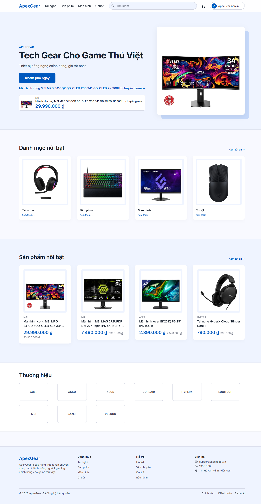
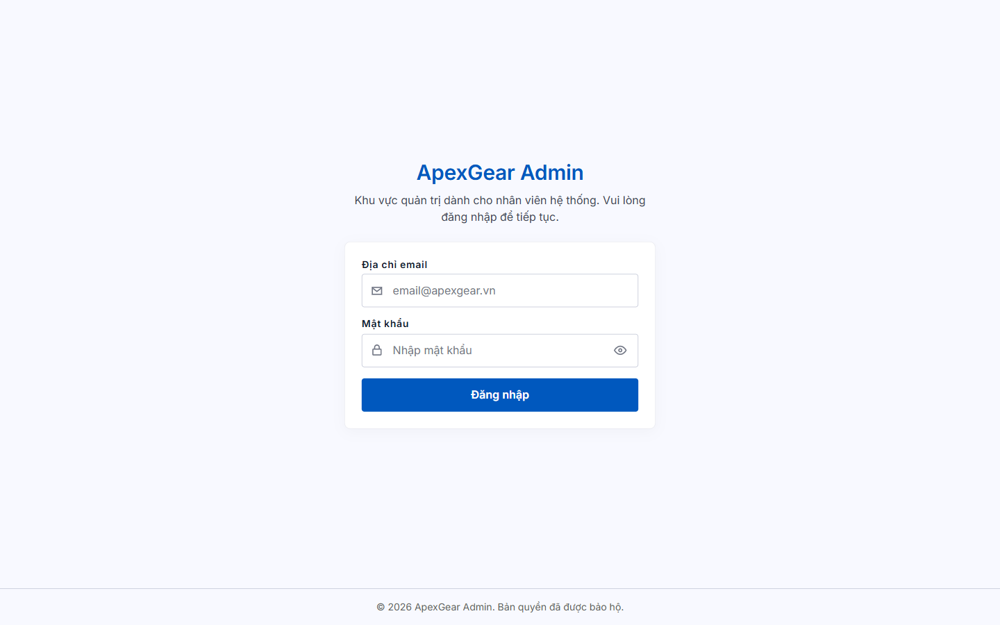
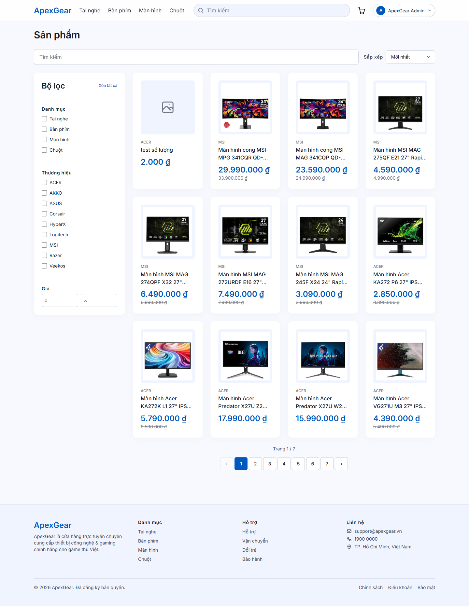
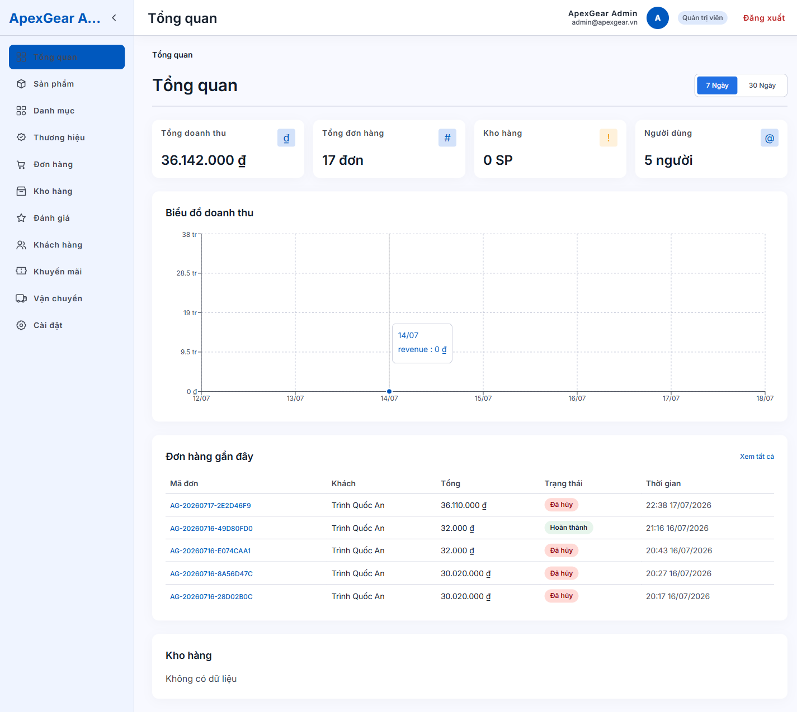
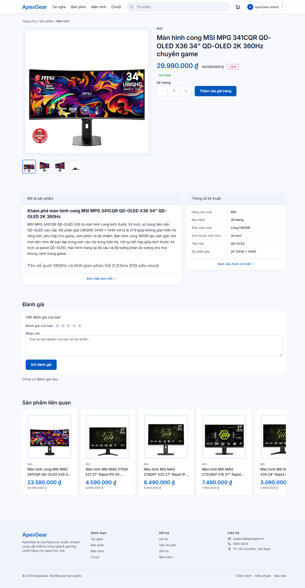
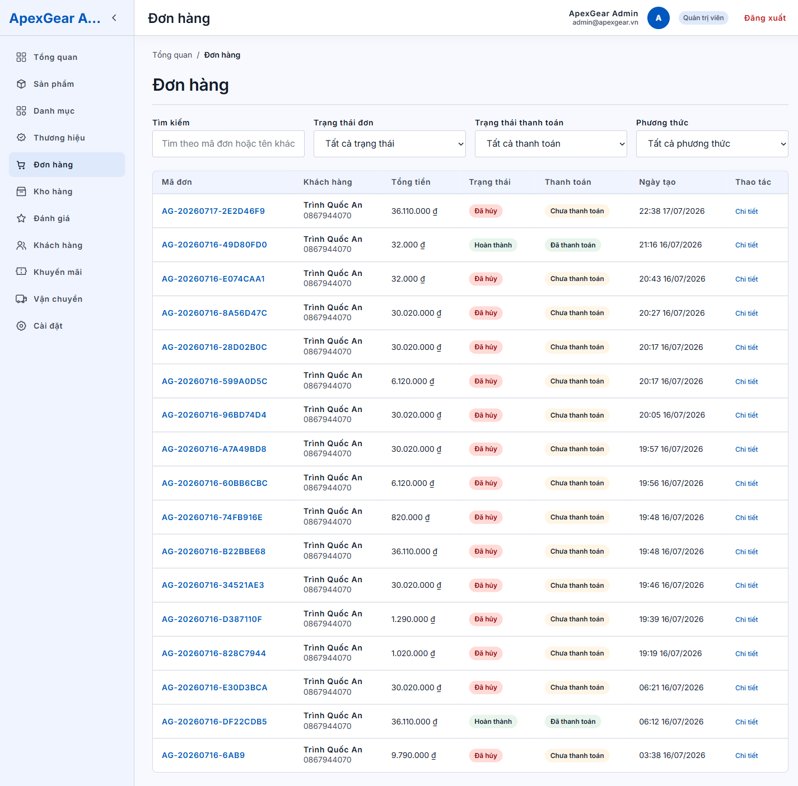
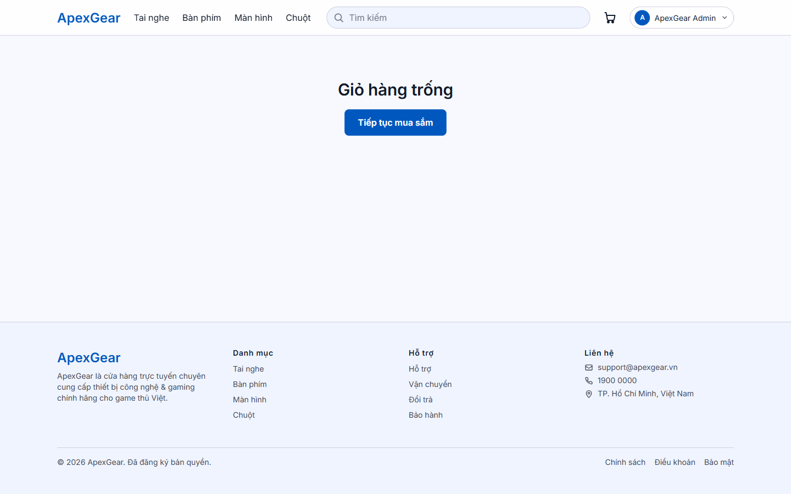
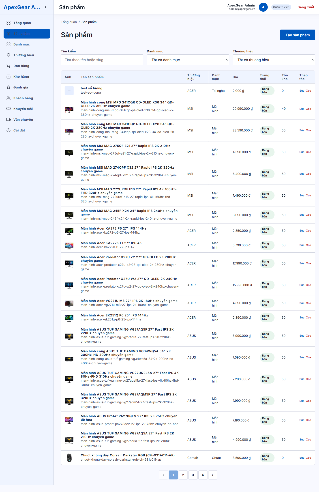
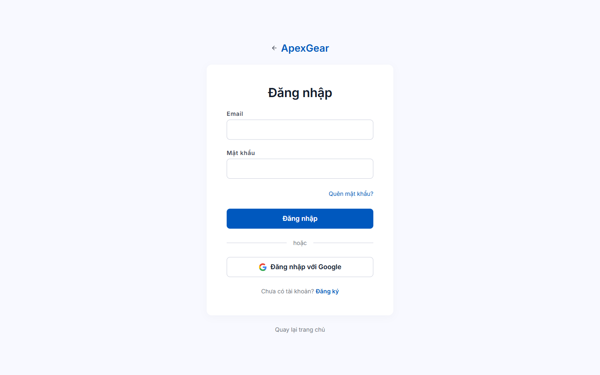

# ApexGear

B2C e-commerce platform for tech peripherals (keyboards, mice, headsets, monitors).

ApexGear is an **npm workspaces monorepo** with a NestJS API, customer storefront, admin dashboard, and a shared TypeScript package. Auth uses JWT in **httpOnly cookies**, checkout runs inside **Prisma transactions**, and bank-transfer payments integrate with **SePay** (HMAC-verified webhooks).

---

## Architecture

```
ApexGear/
├── apps/
│   ├── api/          # NestJS + Prisma + SQL Server  (port 3001)
│   ├── web/          # Customer storefront (Vite + React)  (port 5173)
│   └── admin/        # Admin dashboard (Vite + React)  (port 5174)
├── packages/
│   └── shared/       # Shared enums, roles, order transitions, formatters
├── docs/             # Design specs & implementation plans
├── DESIGN.md         # Lumina Tech design system
└── package.json      # Workspace root
```

| App / package | Stack | Responsibility |
|---|---|---|
| `apps/api` | NestJS, Prisma ORM, SQL Server, Swagger | RESTful API, auth, orders, payments, catalog |
| `apps/web` | React 19, Vite, Tailwind v4, Zustand, react-i18next | Customer shopping experience (locale: `vi`) |
| `apps/admin` | React 19, Vite, Zustand, Recharts, TipTap | Back-office: catalog, orders, inventory, reports |
| `packages/shared` | TypeScript | Enums, RBAC helpers, order-status transitions |

API requests from the frontends go through a Vite proxy: `/api` → `http://localhost:3001`.

---

## Features

### Backend (`apps/api`)
- **Auth & security** — JWT httpOnly cookies, Google OAuth, password reset (SMTP), account lock after failed logins, IP throttle on failed attempts (`@nestjs/throttler`)
- **RBAC** — 5 roles: `CUSTOMER`, `ADMIN`, `CONTENT_MANAGER`, `INVENTORY_MANAGER`, `ORDER_MANAGER`
- **Catalog** — Categories (2-level), brands, products with variants / images / specs, Cloudinary uploads
- **Commerce** — Cart, addresses, coupons, checkout with stock check/deduction/restore, shipping fee rules
- **Payments** — SePay QR + webhook (`HMAC SHA-256` + `timingSafeEqual`), transfer timeout handling
- **Ops** — Inventory adjustments, order lifecycle, reviews moderation, dashboard stats/revenue, settings
- **Data integrity** — Soft delete with SQL Server **filtered unique indexes**; province/ward cache (TTL 24h)

### Customer web (`apps/web`)
- Product browse / search, cart, checkout, order history
- Auth flows (login, register, Google, forgot/reset password)
- Lumina Tech design tokens + Vietnamese i18n only

### Admin (`apps/admin`)
- Product/brand/category/region management
- Order management, inventory, coupons, reviews
- Dashboard charts, rich text (TipTap), role-aware UI

---

## Tech stack

| Layer | Technologies |
|---|---|
| Runtime | Node.js 20+, TypeScript |
| API | NestJS, Prisma, SQL Server, Passport (JWT / Google), Swagger, event-emitter, schedule |
| Web / Admin | React 19, Vite, Tailwind CSS v4, Zustand, Axios (`withCredentials`), react-i18next |
| Shared | `@apexgear/shared` workspace package |
| Media | Cloudinary |
| Payments | SePay |
| Tooling | npm workspaces, ESLint / oxlint, Jest (API), Vitest (web/admin), Playwright (E2E / crawler scripts) |

---

## Prerequisites

- **Node.js** 20+
- **SQL Server** (local instance or Docker)
- Optional: Cloudinary, Google OAuth credentials, Gmail SMTP app password, SePay webhook secret

---

## Quick start

### 1. Install dependencies

```bash
npm install
```

`postinstall` runs `prisma generate` for the API schema.

### 2. Environment

```powershell
copy .env.example apps\api\.env
```

Edit `apps/api/.env` and set at least:

| Variable | Purpose |
|---|---|
| `DATABASE_URL` | SQL Server connection string |
| `JWT_SECRET` | JWT signing secret |
| `FRONTEND_URL` / `ADMIN_URL` | CORS origins (`http://localhost:5173`, `http://localhost:5174`) |
| `CLOUDINARY_*` | Image uploads (optional for non-upload flows) |
| `GOOGLE_*` | Google OAuth (optional) |
| `SMTP_*` | Password-reset email (optional) |
| `SEPAY_*` | Bank-transfer webhook (optional in local mock) |

Root `.env.example` is the template for these keys.

### 3. Database (Docker example)

```powershell
docker run -e "ACCEPT_EULA=Y" -e "MSSQL_SA_PASSWORD=YourPassword123" `
  -p 1433:1433 --name apexgear-sql -d mcr.microsoft.com/mssql/server:2022-latest
```

Align `DATABASE_URL` in `apps/api/.env` with your instance.

### 4. Migrate & seed

```powershell
cd apps\api
npx prisma generate
npx prisma migrate dev
npx prisma db seed
cd ..\..
```

Filtered unique indexes for soft-delete (email, slugs, SKU, etc.) ship as custom SQL migrations under `apps/api/prisma/migrations/`.

### 5. Run apps

```powershell
# Terminal 1 — API (http://localhost:3001)
npm run dev:api

# Terminal 2 — Customer web (http://localhost:5173)
npm run dev:web

# Terminal 3 — Admin (http://localhost:5174)
npm run dev:admin
```

| Service | URL |
|---|---|
| API | http://localhost:3001/api |
| Swagger | http://localhost:3001/api/docs |
| Customer web | http://localhost:5173 |
| Admin | http://localhost:5174 |

Use accounts created by the seed script in your local database (do not commit real credentials).

---

## Workspace scripts

| Script | Description |
|---|---|
| `npm run dev:api` | API in watch mode |
| `npm run build:api` | Build API |
| `npm run lint:api` | ESLint API |
| `npm run dev:web` | Customer web (Vite) |
| `npm run test:web` | Vitest (web) |
| `npm run dev:admin` | Admin (Vite) |
| `npm run build:admin` | Build admin |
| `npm run lint:admin` | Lint admin |
| `npm run test:admin` | Vitest (admin) |

API-only (from `apps/api`):

```bash
npm run test          # unit tests
npm run test:e2e      # e2e (Jest + Supertest)
npm run crawl         # product crawler (Playwright)
npm run seed:crawled  # seed crawled catalog
```

---

## Design system

UI follows **Lumina Tech** (`DESIGN.md`):

- Primary: `#0058be`
- Surface: `#f8f9ff`
- On-surface: `#121c2a`
- Font: Inter (via project tokens)

Frontend tokens live in each app’s CSS (`@theme` / Tailwind v4). Prefer design tokens over hardcoded colors.

---

## Screenshots

Actual UI captured from the running app (storefront on `5173`, admin on `5174`). All screens render the Lumina Tech tokens and Vietnamese locale.

| Storefront | Admin |
|---|---|
|  |  |
|  |  |
|  |  |
|  |  |
|  | |

- **Storefront** — home, product listing, product detail, cart, customer login
- **Admin** — login, dashboard (Tổng quan), orders (Đơn hàng), products (Sản phẩm)

---

## Documentation

| Document | Path |
|---|---|
| Product / system design | `docs/superpowers/specs/` |
| Implementation plans | `docs/superpowers/plans/` |
| Design system | `DESIGN.md` |
| Project agent notes | `CLAUDE.md` |

---

## Security notes

- Cookies: JWT in **httpOnly** cookies; Axios clients use `withCredentials: true`
- Login: failed-attempt counting + account lock + IP throttle
- Webhooks: SePay signatures verified with **HMAC SHA-256** and constant-time compare
- Soft delete: unique constraints enforced only on active rows via filtered indexes
- Never commit real secrets, webhook keys, or production credentials — use `.env` (gitignored)

---

## License

Private / unlicensed personal project (`UNLICENSED`). Not published as open source.
