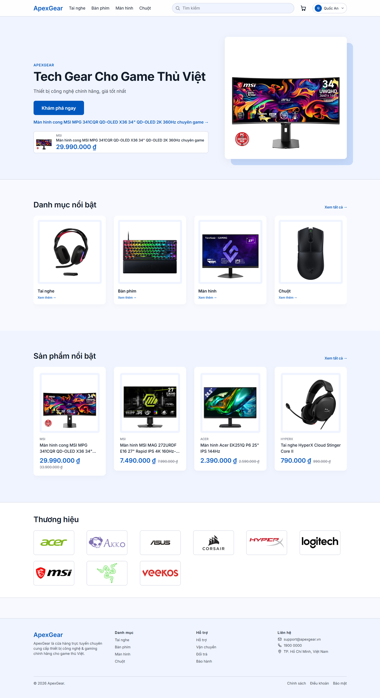
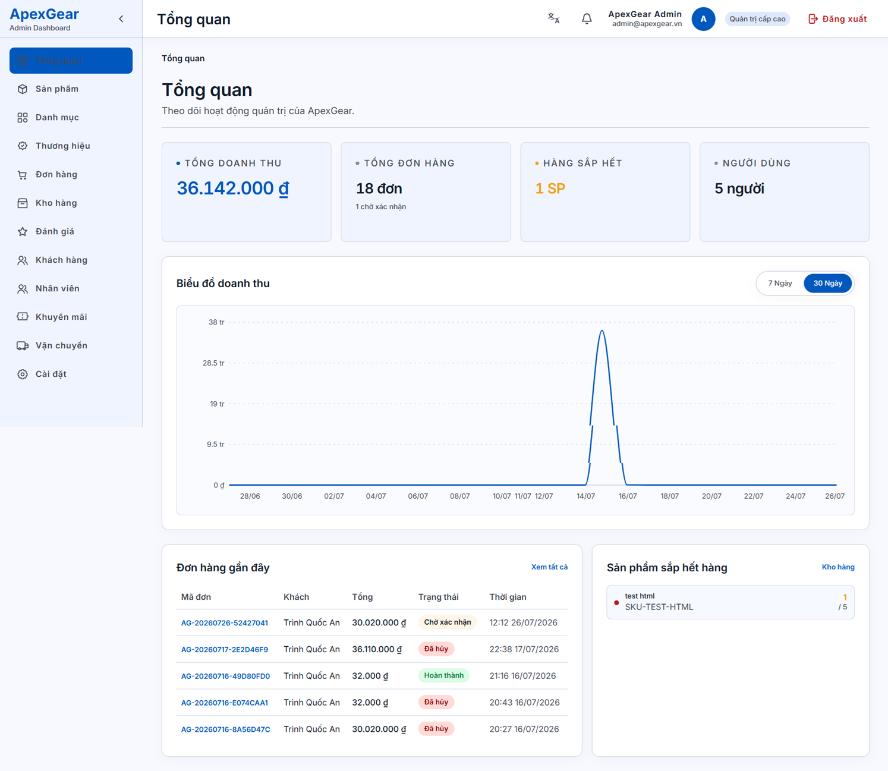

# ApexGear

> **Project cá nhân ApexGear** — Nền tảng thương mại điện tử B2C chuyên cung cấp thiết bị công nghệ & gaming gear (bàn phím, chuột, tai nghe, màn hình) cho game thủ Việt, tích hợp thanh toán tự động qua SePay webhook, phân quyền RBAC chặt chẽ và tìm kiếm bằng PostgreSQL Full-Text Search.

---

## Demo Trực Tuyến

Bạn có thể trải nghiệm trực tiếp hệ thống đã được triển khai (đừng quên chờ 30-50s nếu API trên Render bị sleep):

* **Web (Storefront):** [https://apexgear-web.vercel.app](https://apexgear-web.vercel.app)
* **Admin Dashboard:** [https://apexgear-admin.vercel.app](https://apexgear-admin.vercel.app)
* **API Swagger Docs:** [https://apexgear-api.onrender.com/api/docs](https://apexgear-api.onrender.com/api/docs)

> 💡 **Xem [Tài khoản Demo](#đăng-nhập-bằng-tài-khoản-demo)** ở bên dưới để lấy thông tin đăng nhập test các tính năng phân quyền.

---

## Hướng dẫn chạy Docker

### Bước 1 — Tải Docker Desktop

* Tải và cài [Docker Desktop bản mới nhất](https://www.docker.com/products/docker-desktop/)

### Bước 2 — Khởi chạy Docker

Mở terminal tại **thư mục gốc** của dự án:

```bash
docker compose watch
# mất khoảng ~5 phút ở lần đầu, ~30 giây cho các lần sau
```

### Bước 3 — Kiểm tra nhanh

Mở một terminal **khác** tại thư mục gốc và chạy:

```bash
docker ps
```

Kết quả mong đợi (hiển thị các IMAGE sau):

| IMAGE                | STATE         | STATUS           | PORT |
|:-------------------- |:------------- |:---------------- |:---- |
| `apexgear-api`       | Đang hiển thị | **Up**           | 3001 |
| `postgres:15-alpine` | Đang hiển thị | **Up (healthy)** | 5433 |
| `apexgear-admin`     | Đang hiển thị | **Up**           | 5174 |
| `apexgear-web`       | Đang hiển thị | **Up**           | 5173 |

### Đăng nhập bằng tài khoản demo

Tất cả sáu tài khoản dùng chung mật khẩu: **`Test@123456`**

| Email                    | Vai trò           | Test thử                                            |
|:------------------------ |:----------------- |:--------------------------------------------------- |
| `customer@apexgear.vn`   | CUSTOMER          | Browse + đặt hàng ở Storefront (5173)               |
| `content@apexgear.vn`    | CONTENT_MANAGER   | CRUD sản phẩm / brand / category trong Admin (5174) |
| `inventory@apexgear.vn`  | INVENTORY_MANAGER | Quản lý tồn kho và biến thể sản phẩm                |
| `order@apexgear.vn`      | ORDER_MANAGER     | Xử lý đơn hàng, cập nhật trạng thái giao hàng       |
| `admin@apexgear.vn`      | ADMIN             | Toàn quyền admin (trừ quản lý role)                 |
| `superadmin@apexgear.vn` | SUPER_ADMIN       | Full access, bao gồm phân quyền RBAC                |

## Giao diện thực tế của dự án

#### 1. Trang chủ cửa hàng (Storefront)



#### 2. Trang quản trị hệ thống (Admin Dashboard)



---

## Bài toán & Giải pháp thực tế

### Vấn đề thực tế

* Trải nghiệm mua sắm thiết bị gaming trực tuyến tại Việt Nam còn phân mảnh, đặc biệt khâu thanh toán chuyển khoản ngân hàng thường làm thủ công (phải chụp ảnh màn hình giao dịch gửi cho admin xác nhận), gây tốn thời gian và dễ nhầm lẫn.
* Việc quản lý kho hàng, danh mục sản phẩm phức tạp, thiếu phân quyền (RBAC) rõ ràng cho nhân viên kho, nhân viên đơn hàng, nhân viên nội dung dẫn đến thất thoát hoặc sai sót dữ liệu.
* Tìm kiếm sản phẩm không hiệu quả trên lượng dữ liệu lớn khi chỉ sử dụng truy vấn `LIKE` thông thường.

### Giải pháp của bạn

* **Kiến trúc Monorepo đồng bộ:** Xây dựng hệ thống monorepo tích hợp Storefront, Admin Dashboard và API Backend, giao tiếp mượt mà qua proxy và JWT cookie-based auth.
* **Tự động hóa thanh toán ngân hàng:** Tích hợp cổng SePay QR + webhook tự động xác thực chữ ký HMAC SHA-256, chuyển trạng thái đơn hàng ngay lập tức khi nhận tiền chuyển khoản.
* **Hệ thống phân quyền (RBAC) chi tiết:** Chia nhỏ quyền hạn với 5 roles (`CUSTOMER`, `ADMIN`, `CONTENT_MANAGER`, `INVENTORY_MANAGER`, `ORDER_MANAGER`) giúp quản trị viên vận hành hệ thống chuyên nghiệp và an toàn.
* **Tối ưu tìm kiếm:** Triển khai PostgreSQL Full-Text Search (raw queries + unaccent + GIN index) xử lý tiếng Việt có dấu, tìm kiếm sản phẩm tối ưu.
* **Đồng bộ đa ngôn ngữ:** Hỗ trợ đa ngôn ngữ hoàn chỉnh (`vi` / `en`) bằng `react-i18next` cho cả Storefront và Admin.

---

## Công nghệ sử dụng

| Thành phần             | Công nghệ                                   | Lý do chọn lựa                                                                                                                            |
|:---------------------- |:------------------------------------------- |:----------------------------------------------------------------------------------------------------------------------------------------- |
| **Frontend**           | React 19 + Vite + Tailwind CSS v4 + Zustand | React 19 tối ưu render, Tailwind v4 hiện đại hóa CSS, Zustand quản lý state đơn giản, trực quan thay vì Redux cồng kềnh.                  |
| **Backend**            | NestJS + TypeScript                         | NestJS cung cấp cấu trúc code modular chuẩn mực, TypeScript tăng tính an toàn và minh bạch cho mã nguồn.                                  |
| **Database**           | PostgreSQL + Prisma ORM                     | PostgreSQL mạnh mẽ về giao dịch, hỗ trợ Full-Text Search tốt; Prisma ORM tăng tốc phát triển và bảo đảm an toàn kiểu dữ liệu (type-safe). |
| **Thanh toán & Media** | SePay API + Cloudinary                      | SePay tự động hóa webhook ngân hàng; Cloudinary quản lý và tối ưu hóa hình ảnh sản phẩm phân phát qua CDN.                                |

---

## Tính năng cốt lõi

* **Xác thực và Bảo mật nâng cao:** Đăng nhập JWT qua httpOnly cookies, bảo vệ tài khoản chống tấn công brute-force (khóa tài khoản 15 phút sau 5 lần nhập sai), giới hạn tần suất request IP (IP throttle dùng `@nestjs/throttler`).
* **Phân quyền người dùng (RBAC):** Phân chia 5 roles giúp vận hành doanh nghiệp e-commerce: Quản lý catalog sản phẩm, quản lý kho hàng, quản lý đơn hàng, và giám sát chung.
* **Thanh toán tự động (SePay Webhook):** Tạo mã QR chuyển khoản và xác thực webhook tự động bằng thuật toán so sánh an toàn thời gian chữ ký HMAC SHA-256.
* **Checkout an toàn với Transaction:** Áp dụng cơ chế Prisma Transactions khi thanh toán để kiểm tra, trừ tồn kho và khôi phục tồn kho tự động nếu đơn hàng hủy/thất bại, loại bỏ race condition.
* **Thông báo Realtime cho Admin:** Sử dụng cơ chế Server-Sent Events (SSE) để đẩy thông báo realtime lên giao diện Admin khi có đơn hàng mới hoặc sản phẩm sắp hết hàng.
* **Xóa mềm (Soft Delete):** Sử dụng xóa mềm (`deletedAt`) kết hợp SQL Server filtered unique indexes để lưu trữ dữ liệu lịch sử mà không lo trùng lặp định danh email hay SKU.

---

## Kiến trúc & Thiết kế Database

Kiến trúc luồng dữ liệu của hệ thống:

```
[Khách hàng / Admin Web]
          │
      (HTTP/Vite Proxy)
          │
          ▼
    [NestJS Web API] ──(Authentication / JWT)
          │
     (Prisma ORM)
          │
          ▼
    [PostgreSQL Database]
```

*Note: Sơ đồ database chi tiết có thể được tham khảo trong file [schema.prisma](file:///E:/SourceCode/ApexGear/apps/api/prisma/schema.prisma). Cơ sở dữ liệu bao gồm các bảng được chuẩn hóa: User, Product, Category, Brand, Order, OrderItem, Cart, CartItem, Inventory, Coupon, Notification.*

---

## Hướng dẫn chạy local

Làm theo các bước sau để chạy dự án trên máy tính của bạn:

### 1. Yêu cầu hệ thống

* Node.js phiên bản `>= 20.x`
* Cài đặt sẵn PostgreSQL (hoặc chạy qua Docker — cấu hình Docker PostgreSQL là follow-up)

### 2. Cài đặt các thư viện bổ sung

```bash
# Cài đặt toàn bộ dependencies tại thư mục gốc monorepo
npm install
```

### 3. Cấu hình biến môi trường (Environment Variables)

Tạo file `.env` tại thư mục `apps/api/` dựa trên template `.env.example`:

```powershell
copy apps\api\.env.example apps\api\.env
```

Điền các giá trị thích hợp, đặc biệt là `DATABASE_URL` kết nối tới PostgreSQL của bạn, `JWT_SECRET`, và các khóa API (SePay, Cloudinary, v.v. nếu cần test tính năng thực tế).

### 4. Khởi chạy cơ sở dữ liệu

Chạy các lệnh sau tại thư mục API để khởi tạo cơ sở dữ liệu và seed dữ liệu mẫu:

```bash
cd apps/api
npx prisma generate
npx prisma db push
npm run seed:snapshot
cd ../..
```

### 5. Khởi chạy dự án

Mở 3 terminal song song để chạy các dự án con (hoặc chạy riêng lẻ):

```bash
# Chạy Backend API (Port 3001)
cd apps/api
npm run dev

# Chạy Storefront Customer (Port 5173)
cd apps/web
npm run dev

# Chạy Admin Dashboard (Port 5174)
cd apps/admin
npm run dev
```

---

## Kết quả đạt được

* **Hiệu suất & Tính năng:** Rút ngắn quy trình xác nhận thanh toán chuyển khoản ngân hàng tự động chỉ trong vài giây. Đồng thời, giải quyết triệt để bài toán đồng bộ tồn kho e-commerce bằng transaction.
* **Bản địa hóa & Trải nghiệm:** Giao diện Lumina Tech hiện đại, hỗ trợ tiếng Việt mượt mà giúp người dùng dễ tiếp cận.
* **Quy mô thử nghiệm:** Đã thử nghiệm thành công toàn bộ luồng mua hàng và xử lý đơn hàng nội bộ tại local với tập dữ liệu seed đa dạng.
* **Nội dung / Trang thông tin pháp lý:** *Note: Các trang tĩnh như Hỗ trợ (`/help`), Vận chuyển (`/shipping`), Đổi trả (`/returns`), Bảo hành (`/warranty`), Chính sách (`/policy`), Điều khoản (`/terms`), Bảo mật (`/privacy`) hiện chỉ là giao diện boilerplate tĩnh cơ bản, chưa có nội dung đầy đủ.*
* **Các tính năng chưa phát triển (TODO / Future Enhancements):** *Note: Dự án chưa phát triển các tính năng nâng cao sau (theo spec tương lai):*
  * Banner slider trang chủ cho admin quản lý.
  * Audit log thật ghi nhận chi tiết thao tác Admin/Staff (chỉ mới bảo toàn dữ liệu bằng soft-delete + isActive).
  * Danh sách yêu thích (Wishlist) & So sánh sản phẩm.
  * Đánh giá sản phẩm kèm hình ảnh.
  * Tìm kiếm nâng cao bằng Elasticsearch / MeiliSearch (hiện đang dùng PostgreSQL FTS).
  * Cơ chế Token revocation dùng `tokenVersion`.
  * Live chat support & Analytics dashboard nâng cao cho Admin.
  * Hỗ trợ Progressive Web App (PWA).

---

## Thông tin liên hệ

* **Tác giả:** Trình Quốc An
* **Email:** `trinhquocan999@gmail.com`
* **GitHub Project:** [github.com/quocan9999/ApexGear](https://github.com/quocan9999/ApexGear)
* **Facebook:** [Trinh Quoc An](https://facebook.com/perossss)
